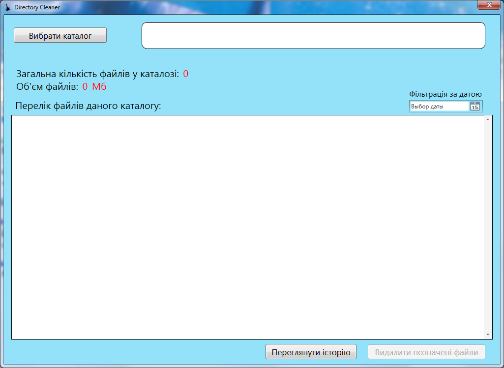
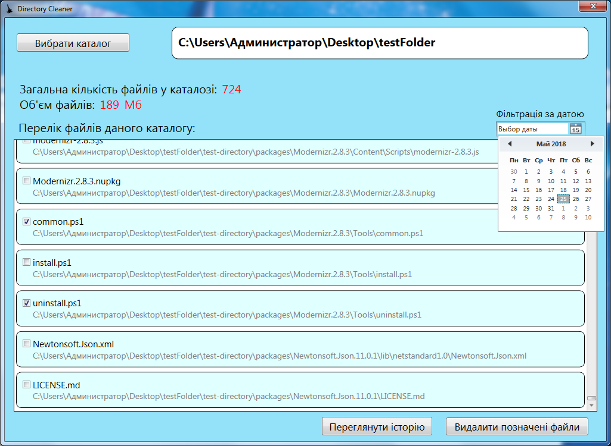
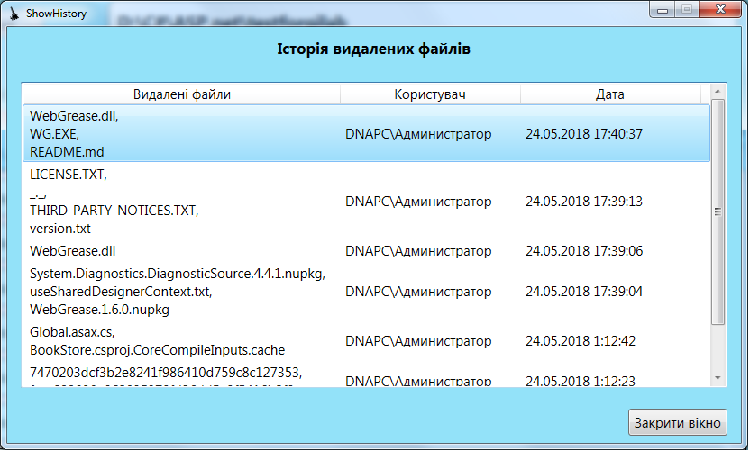
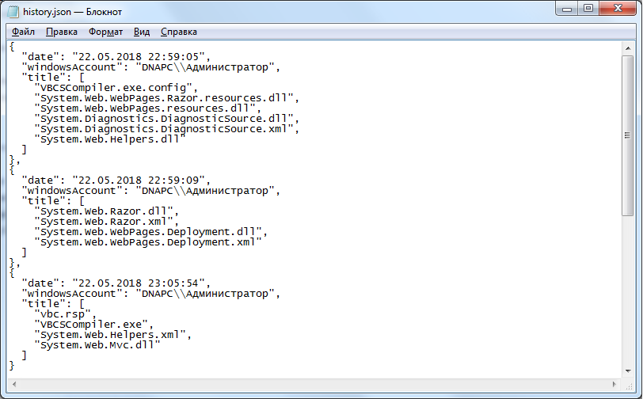

# Directory Cleaner

## Student Info
* Nazar Melnyk, OKSM-41

### Estimate - 60h
Розробити настільний додаток для роботи з файловою системою. Юзер повинен мати можливість обрати в програмі каталог для роботи. Після вибору каталoгу додаток повинен рекурсивно відсканувати усі файли в каталозі та його підкаталогах і вивести наступну інформацію:
* Загальна кількість файлів в каталогу.
* Загальний об’єм файлів.
* Список файлів, які були останній раз модифіковані більше двох тижнів тому (краще, якщо користувач буде мати змогу обирати часовий проміжок).

Користувач повинен мати можливість в програмі відмітити файли зі списку, згаданого раніше, та видалити їх.
Історія видалень повинна зберігатися в окремому файлі в будь-якому з зазначених форматів: XML, JSON. Історія повинна містити:
* Час зміни.
* Список видалених файлів.
* Особу, яка здійснила видалення (Windows Account).

### Головне вікно:

  

  

### Перегляд історії видалених файлів.
  

### Формат збереження історії видалених файлів (JSON).
  

### Ссилка на інший проект:
https://gitlab.com/nazmel/videos-access-point